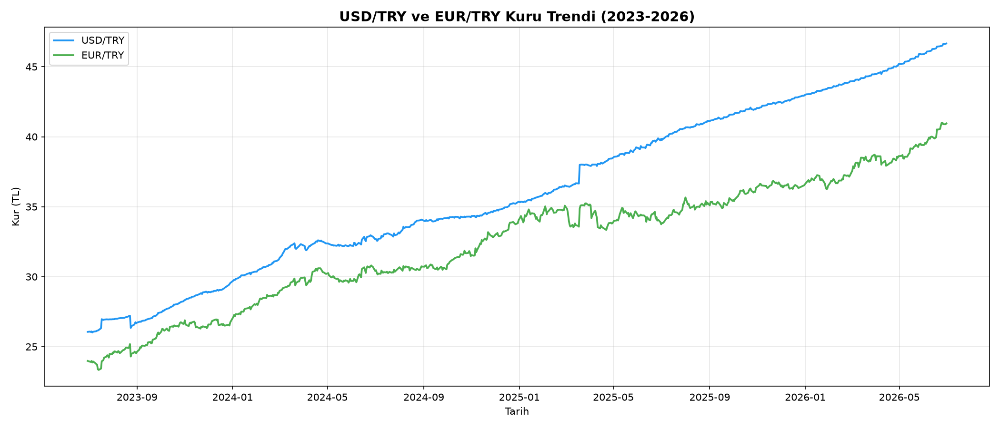
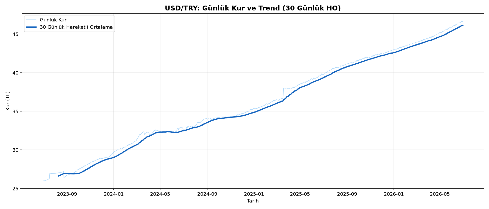
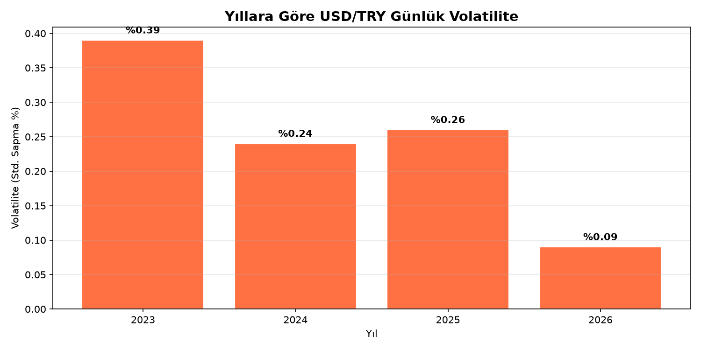

# 💱 USD/TRY ve EUR/TRY Döviz Kuru Analizi

## 📌 Proje Hakkında
Bu proje, Frankfurter API kullanılarak 2023-2026 yılları arasındaki
USD/TRY ve EUR/TRY döviz kurlarını gerçek zamanlı olarak çekip analiz etmektedir.

## 📊 Analizler

## 🔍 Temel Bulgular
- USD/TRY 2023-2026 arasında **%79** değer kazanmıştır
- 2023 yılı en yüksek günlük volatiliteye sahiptir (%0.39)
- 2026 yılında volatilite belirgin şekilde düşmüştür (%0.09)

## 🛠️ Kullanılan Teknolojiler
- Python, Pandas, Matplotlib
- Frankfurter API (gerçek zamanlı döviz verisi)
- Jupyter Notebook

## 🚀 Nasıl Çalıştırılır

    pip install -r requirements.txt
    jupyter notebook notebooks/01_doviz_analizi.ipynb

## 📬 İletişim
[LinkedIn](www.linkedin.com/in/elifcakir1705) | [GitHub](https://github.com/elifcakir1875)